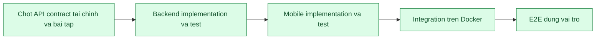

# F18 - Quy trinh contract -> phat trien -> E2E

Cap nhat: 11/08/2026

## Trang thai hien tai

## Da hoan thanh

- Tao OpenAPI contract cho luong F17: xem hoa don, thanh toan, thu tien mat, VietQR, doi soat va hoan tien.
- Moi operation co role, object permission, request/response, nullable, error status, idempotency va owner.
- Them contract test de build that bai khi thieu metadata hoac endpoint cot loi.
- Docker image chay toan bo `60/60` backend test; rieng contract `2/2`, security/integration `47/47`.
- Backend va PostgreSQL dang `healthy`; actuator tra `UP`.
- Live API: chua dang nhap tra `401`; Ke toan dang nhap thanh cong; danh sach VietQR cho doi soat tra `200`.
- Mobile F17 da co cac man hinh hoa don, VietQR, thu tien mat, hoan tien va lich su theo dung vai tro.
- Tao OpenAPI contract F11 cho bai tap, nop bai, cham diem, nop lai va truy cap cua phu huynh.
- Sua lo hong pham vi F11: giao vien khong con doc duoc bai nhap cua giao vien khac; phu huynh bi chan khoi API tong.
- Docker image chay `62/62` backend test; contract `3/3`, security/integration `48/48`.
- E2E F11 live da dat: DRAFT an voi hoc sinh, publish hien dung lop, dong bai tra `409`, mo lai nop thanh cong, giao vien cham va phu huynh xem ket qua.
- Mobile Web hien bai da cham va feedback cho hoc sinh; man Teacher hien tien do nop `1/1`.
- `flutter analyze` khong co loi; Mobile test `21` dat va `4` integration test bo qua theo cau hinh hien tai.
- Tao `file.yaml` cho upload, metadata va download private; response khong con lo `storageName` va `uploadedBy`.
- E2E file dat: file chua gan bi chan `403`; sau khi gan, dung Student, Teacher va Parent lien quan tai duoc `200`.
- Docker image moi chay `63/63` backend test; contract `4/4`, security/integration `48/48`.
- Tao `chat.yaml` va `notification.yaml` cho F12: danh ba theo pham vi, tin nhan, unread, realtime, inbox, preview va gui announcement.
- Sua quyen F12: Phu huynh co the trao doi hai chieu voi GVCN va giao vien bo mon cua con; khong nhin thay danh ba toan truong.
- Sua realtime Mobile khop payload backend va hien trang thai tin gui `Da gui` / `Da xem`.
- Mo hoi thoai qua ca API thuong va API phan trang deu danh dau da doc va phat su kien `CHAT_READ`.
- Unread chi dem tin tu lien he con hop le, khong tinh tin lich su da nam ngoai pham vi.
- Docker image chay `65/65` backend test; contract `6/6`, security/integration `48/48`.
- `flutter analyze` sach; Mobile test `21` dat va `4` integration test bo qua theo cau hinh hien tai.
- E2E F12 live dat: Phu huynh -> GV bo mon, read receipt, chan Parent -> Admin `403`, preview audience va announcement idempotent.
- Tao `club.yaml` cho F13: danh sach/tao CLB, hoc sinh hoac phu huynh dang ky, Admin duyet/tu choi va huy dang ky.
- Mobile Admin co man `Tien ich -> Quan ly cau lac bo`: danh sach CLB, form tao moi, loc dang ky va thao tac duyet/tu choi.
- F13 bao phu quan he phu huynh-con, dang ky trung, gioi han suc chua, waitlist, duyet thu cong, sinh hoa don va tu dong day nguoi cho len khi con cho.
- Docker image chay `66/66` backend test; contract `7/7`, security/integration `48/48`.
- `flutter analyze` sach; Mobile test `23` dat va `4` integration test bo qua theo cau hinh hien tai; Flutter Web build thanh cong.
- E2E F13 live dat: dang ky trung `409`, chon hoc sinh khong thuoc phu huynh `403`, auto-approve co hoa don, het cho vao `WAITLIST`, Admin duyet thu cong va giu mot dang ky `PENDING` de kiem tra UI.
- Chuan hoa S01 bang `InvoiceStateMachine`: suy luan tap trung `UNPAID`, `OVERDUE`, `PARTIAL`, `PAID`, `PARTIALLY_REFUNDED`, `REFUNDED`, `CANCELLED` va khoa thao tac thu/hoan theo state.
- OpenAPI Finance khai bao `x-state-transitions`; contract test khoa enum va cac terminal state `REFUNDED`, `CANCELLED`.
- Mobile Phu huynh hien khoi trang thai hoa don, so tien con phai tra/da hoan va buoc tiep theo; Mobile Ke toan loc duoc hoa don `CANCELLED`.
- Docker image chay `69/69` backend test; contract `7/7`, security/integration `48/48`; rieng state machine `3/3`.
- `flutter analyze` sach; Mobile test `30` dat va `4` integration test bo qua theo cau hinh hien tai; Flutter Web build thanh cong.
- E2E S01 live dat: thu mot phan, thu du, hoan mot phan/toan bo, huy hoa don; thu hoac hoan sai state deu bi chan `409`.
- Da cai Android SDK 36, Build Tools 36, NDK 28.2, CMake 3.22.1 va tao AVD `SSE_API_36` tren Windows.
- Mobile da build APK debug native, cai len Android 16 emulator va dang nhap Admin thanh cong qua backend Docker.
- Native smoke test tai du lieu that tren Dashboard Admin: `8` tai khoan, `3` lop va `4` muc can xu ly; khong co `FATAL EXCEPTION`.
- Nang `file_picker` len `10.3.10` de dong bo compileSdk 36; tat Kotlin incremental cache do Pub cache o `C:` va project o `E:`.
- Native Android F11 da chay tron luong Teacher tao/publish -> Student nop -> Teacher cham -> Student xem ket qua bang backend Docker that.
- Da sua man do Flutter sau khi nop bai: `TextEditingController` cua dialog nay duoc quan ly theo vong doi State va chi dispose khi dialog unmount.
- Retest nop lai dat: backend ghi nhan lan nop `2`; log Android khong con assertion `_dependents.isEmpty` hoac `FATAL EXCEPTION`.
- `flutter analyze` sach; Mobile test `30` dat va `4` integration test bo qua theo cau hinh hien tai sau ban sua F11.
- Native Android F12 da chay tron luong Parent gui tin -> Teacher doc/phan hoi -> read receipt va Teacher gui announcement toi hoc sinh, phu huynh.
- Da sua man do sau khi gui announcement: controller cua bottom sheet duoc quan ly theo vong doi State, khong dispose khi animation dong con chay.
- Da sua refresh danh sach chat: callback `setState` chi cap nhat Future dong bo, khong con tra Future trong closure.
- Retest F12 dat: danh sach announcement refresh ngay; Student va Parent deu nhan thong bao in-app; log khong con assertion, unhandled exception hoac `FATAL EXCEPTION`.
- Bao ve F12 dat: Parent -> Admin bi chan `403`; gui hai lan cung idempotency key tra cung ID va chi luu mot announcement.
- `flutter analyze` sach; Mobile test `30` dat va `4` integration test bo qua theo cau hinh hien tai sau ban sua F12.
- Native Android F13 da xac nhan CLB co phi, can duyet va gioi han mot cho tren UI Student; trang thai, phi va so cho hien dung du lieu backend.
- E2E F13 native dat: dang ky lan dau `PENDING`, dang ky trung bi chan `409`, Admin duyet sinh hoa don, het cho vao `WAITLIST`, Admin tu choi khong sinh hoa don va Parent ngoai pham vi bi chan `403`.

## Du lieu E2E giu lai

- Bai tap: `asg-f18-e2e-20260810-172102` - `F18 E2E - Bai tap Toan giu lai`.
- Bai nop: `sub-f80406bafb` cua hoc sinh Nguyen Minh An.
- Ket qua: `GRADED`, diem `8.75`, co feedback cua giao vien.
- Han nop: `17/08/2026 17:00` theo gio Viet Nam.
- Bai tap co tep: `asg-f18-file-20260810-173629` - `F18 FILE - Bai tap co tep giu lai`.
- Tep de bai: `file-a943172c1a` - `f18-de-bai.txt`.
- Bai nop co tep: `sub-089e5a3b6d`, tep `file-6d754eff77` - `f18-bai-nop.txt`, diem `9.0`.
- Du lieu VietQR F17 truoc do van giu nguyen o trang thai cho doi soat.
- Tin nhan F12: `msg-e7fb9783f7` - Phu huynh trao doi voi giao vien bo mon; da duoc giao vien mo va danh dau da xem.
- Thong bao F12: `an-1875ebce75` - `F12 E2E - Cap nhat tien do lop 10A1`, pham vi `CLASS_ALL:c-10a1`, co `2` nguoi nhan.
- Notification hoc sinh: `noti-bfbb73fbb5`, da danh dau da doc.
- Notification phu huynh: `noti-3820b66e8d`, giu chua doc de kiem tra badge va inbox.
- CLB F13 gioi han mot cho: `club-f13-live-20260811-093513` - `F13 E2E - CLB Khoa hoc va Sang tao`.
- Dang ky da duyet: `cr-7fef26d6d6`, hoa don `inv-b17311b56c`, phi `250.000 d`.
- Dang ky cho cho: `cr-d2196c297b`, trang thai `WAITLIST`, vi tri `1`.
- CLB F13 duyet thu cong: `club-f13-approval-20260811-093513` - `F13 E2E - CLB Tranh bien`.
- Dang ky Admin da duyet: `cr-3d7f28395b`; dang ky giu cho nguoi dung thu: `cr-01832bda75`, trang thai `PENDING`.
- Hoa don S01 `PARTIAL`: `inv-66330a746b`, da thu `250.000 d`, bien nhan `REC-80FCC463479B`, con `750.000 d`.
- Hoa don S01 `PARTIALLY_REFUNDED`: `inv-cd409a26ca`, da hoan `300.000 d`.
- Hoa don S01 `REFUNDED`: `inv-c8543c18cf`, da hoan toan bo `600.000 d`.
- Hoa don S01 `CANCELLED`: `inv-d247592301`; thu tien sau khi huy bi chan `409`.
- Bai tap Android F11: `asg-0090351395` - `FF1`, mon Sinh hoc, lop `c-10a1`.
- Bai nop Android F11: `sub-dc5fbab380`, noi dung `NativeF11Retest`, lan nop `2`.
- Ket qua Android F11: `GRADED`, diem `9.25`, feedback `Dat F11 native Android`.
- Tin nhan Parent -> Teacher Android F12: `msg-bc4708e3f3`, noi dung `F12 Native ParentToTeacher 1108`, da doc.
- Tin nhan Teacher -> Parent Android F12: `msg-449fd994e5`, noi dung `F12 Native TeacherReply 1108`, da doc.
- Announcement Android F12 cuoi: `an-65c74c053b`, noi dung `F12 Native Final 1108`, lop `c-10a1`, co `2` nguoi nhan.
- Announcement idempotent F12: `an-fa56b13384`, gui lap cung key van chi co mot ban ghi va `2` nguoi nhan.
- CLB Android F13: `club-f13-native-20260811-1425` - `F13 Native - CLB Sang tao`, suc chua `1`, phi `275.000 d`, can Admin duyet.
- Dang ky Android F13 da duyet: `cr-563848e6a3`, hoa don `inv-d5d3897160`, trang thai hoa don `UNPAID`.
- Dang ky Android F13 cho cho: `cr-2e97fee5fd`, hoc sinh Pham Hoai Binh, trang thai `WAITLIST`, vi tri `1`.
- Nhanh tu choi Android F13: CLB `club-f13-reject-20260811-1433`, dang ky `cr-cce9c47416`, trang thai `REJECTED`, khong co hoa don.

## Con thieu

- Chua co OpenAPI contract cho cac domain identity va academic tong.
- Chua co pipeline sinh client Mobile tu OpenAPI; hien model/request van duoc duy tri thu cong.
- F11, F12 va F13 da dat tren UI native Android; F17 va S01 chua duoc chay tron bo bang thao tac UI native.
- Chua co E2E tu dong mo UI va thao tac tron luong Phu huynh -> VietQR -> Ke toan doi soat -> bien nhan.
- Contract hien moi bao phu phan tai chinh cot loi, chua bao phu dashboard/report/export.

## Thu tu tiep theo

1. Chay lan luot F17 va S01 tren emulator va giu du lieu nghiem thu.
2. Sinh client Mobile tu OpenAPI de giam request/model viet tay.
3. Bo sung UI E2E tu dong cho cac luong tai chinh tren thiet bi Android.

## Dieu kien dong F18

- Cac API mobile core deu co contract duoc version control va test trong Docker build.
- Khong con mock trong cac luong da nghiem thu.
- Moi luong co loading, empty, error, retry va kiem tra `401/403/404/409` phu hop.
- Mutation quan trong co transaction, audit va idempotency khi can.
- Co E2E tren Android cho dung role va object permission.
