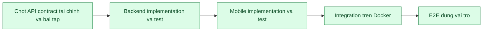

# F18 - Quy trinh contract -> phat trien -> E2E

Cap nhat: 12/08/2026

## Trang thai hien tai

## Da hoan thanh

- Tao OpenAPI contract cho luong F17: xem hoa don, thanh toan, thu tien mat, VietQR, doi soat va hoan tien.
- Moi operation co role, object permission, request/response, nullable, error status, idempotency va owner.
- Them contract test de build that bai khi thieu metadata hoac endpoint cot loi.
- Docker image chay toan bo `60/60` backend test; rieng contract `2/2`, security/integration `47/47`.
- Backend va PostgreSQL dang `healthy`; actuator tra `UP`.
- Live API: chua dang nhap tra `401`; Ke toan dang nhap thanh cong; danh sach VietQR cho doi soat tra `200`.
- Mobile F17 da co cac man hinh hoa don, VietQR, thu tien mat, hoan tien va lich su theo dung vai tro.
- Tao OpenAPI contract F11 cho bai tap, nop bai, cham diem, nop lai va truy cap cua phu huynh.
- Sua lo hong pham vi F11: giao vien khong con doc duoc bai nhap cua giao vien khac; phu huynh bi chan khoi API tong.
- Docker image chay `62/62` backend test; contract `3/3`, security/integration `48/48`.
- E2E F11 live da dat: DRAFT an voi hoc sinh, publish hien dung lop, dong bai tra `409`, mo lai nop thanh cong, giao vien cham va phu huynh xem ket qua.
- Mobile Web hien bai da cham va feedback cho hoc sinh; man Teacher hien tien do nop `1/1`.
- `flutter analyze` khong co loi; Mobile test `21` dat va `4` integration test bo qua theo cau hinh hien tai.
- Tao `file.yaml` cho upload, metadata va download private; response khong con lo `storageName` va `uploadedBy`.
- E2E file dat: file chua gan bi chan `403`; sau khi gan, dung Student, Teacher va Parent lien quan tai duoc `200`.
- Docker image moi chay `63/63` backend test; contract `4/4`, security/integration `48/48`.
- Tao `chat.yaml` va `notification.yaml` cho F12: danh ba theo pham vi, tin nhan, unread, realtime, inbox, preview va gui announcement.
- Sua quyen F12: Phu huynh co the trao doi hai chieu voi GVCN va giao vien bo mon cua con; khong nhin thay danh ba toan truong.
- Sua realtime Mobile khop payload backend va hien trang thai tin gui `Da gui` / `Da xem`.
- Mo hoi thoai qua ca API thuong va API phan trang deu danh dau da doc va phat su kien `CHAT_READ`.
- Unread chi dem tin tu lien he con hop le, khong tinh tin lich su da nam ngoai pham vi.
- Docker image chay `65/65` backend test; contract `6/6`, security/integration `48/48`.
- `flutter analyze` sach; Mobile test `21` dat va `4` integration test bo qua theo cau hinh hien tai.
- E2E F12 live dat: Phu huynh -> GV bo mon, read receipt, chan Parent -> Admin `403`, preview audience va announcement idempotent.
- Tao `club.yaml` cho F13: danh sach/tao CLB, hoc sinh hoac phu huynh dang ky, Admin duyet/tu choi va huy dang ky.
- Mobile Admin co man `Tien ich -> Quan ly cau lac bo`: danh sach CLB, form tao moi, loc dang ky va thao tac duyet/tu choi.
- F13 bao phu quan he phu huynh-con, dang ky trung, gioi han suc chua, waitlist, duyet thu cong, sinh hoa don va tu dong day nguoi cho len khi con cho.
- Docker image chay `66/66` backend test; contract `7/7`, security/integration `48/48`.
- `flutter analyze` sach; Mobile test `23` dat va `4` integration test bo qua theo cau hinh hien tai; Flutter Web build thanh cong.
- E2E F13 live dat: dang ky trung `409`, chon hoc sinh khong thuoc phu huynh `403`, auto-approve co hoa don, het cho vao `WAITLIST`, Admin duyet thu cong va giu mot dang ky `PENDING` de kiem tra UI.
- Chuan hoa S01 bang `InvoiceStateMachine`: suy luan tap trung `UNPAID`, `OVERDUE`, `PARTIAL`, `PAID`, `PARTIALLY_REFUNDED`, `REFUNDED`, `CANCELLED` va khoa thao tac thu/hoan theo state.
- OpenAPI Finance khai bao `x-state-transitions`; contract test khoa enum va cac terminal state `REFUNDED`, `CANCELLED`.
- Mobile Phu huynh hien khoi trang thai hoa don, so tien con phai tra/da hoan va buoc tiep theo; Mobile Ke toan loc duoc hoa don `CANCELLED`.
- Docker image chay `69/69` backend test; contract `7/7`, security/integration `48/48`; rieng state machine `3/3`.
- `flutter analyze` sach; Mobile test `30` dat va `4` integration test bo qua theo cau hinh hien tai; Flutter Web build thanh cong.
- E2E S01 live dat: thu mot phan, thu du, hoan mot phan/toan bo, huy hoa don; thu hoac hoan sai state deu bi chan `409`.
- Da cai Android SDK 36, Build Tools 36, NDK 28.2, CMake 3.22.1 va tao AVD `SSE_API_36` tren Windows.
- Mobile da build APK debug native, cai len Android 16 emulator va dang nhap Admin thanh cong qua backend Docker.
- Native smoke test tai du lieu that tren Dashboard Admin: `8` tai khoan, `3` lop va `4` muc can xu ly; khong co `FATAL EXCEPTION`.
- Nang `file_picker` len `10.3.10` de dong bo compileSdk 36; tat Kotlin incremental cache do Pub cache o `C:` va project o `E:`.
- Native Android F11 da chay tron luong Teacher tao/publish -> Student nop -> Teacher cham -> Student xem ket qua bang backend Docker that.
- Da sua man do Flutter sau khi nop bai: `TextEditingController` cua dialog nay duoc quan ly theo vong doi State va chi dispose khi dialog unmount.
- Retest nop lai dat: backend ghi nhan lan nop `2`; log Android khong con assertion `_dependents.isEmpty` hoac `FATAL EXCEPTION`.
- `flutter analyze` sach; Mobile test `30` dat va `4` integration test bo qua theo cau hinh hien tai sau ban sua F11.
- Native Android F12 da chay tron luong Parent gui tin -> Teacher doc/phan hoi -> read receipt va Teacher gui announcement toi hoc sinh, phu huynh.
- Da sua man do sau khi gui announcement: controller cua bottom sheet duoc quan ly theo vong doi State, khong dispose khi animation dong con chay.
- Da sua refresh danh sach chat: callback `setState` chi cap nhat Future dong bo, khong con tra Future trong closure.
- Retest F12 dat: danh sach announcement refresh ngay; Student va Parent deu nhan thong bao in-app; log khong con assertion, unhandled exception hoac `FATAL EXCEPTION`.
- Bao ve F12 dat: Parent -> Admin bi chan `403`; gui hai lan cung idempotency key tra cung ID va chi luu mot announcement.
- `flutter analyze` sach; Mobile test `30` dat va `4` integration test bo qua theo cau hinh hien tai sau ban sua F12.
- Native Android F13 da xac nhan CLB co phi, can duyet va gioi han mot cho tren UI Student; trang thai, phi va so cho hien dung du lieu backend.
- E2E F13 native dat: dang ky lan dau `PENDING`, dang ky trung bi chan `409`, Admin duyet sinh hoa don, het cho vao `WAITLIST`, Admin tu choi khong sinh hoa don va Parent ngoai pham vi bi chan `403`.
- Them Android E2E tu dong cho F17 o hai muc: API flow va UI flow that.
- UI E2E tu dong dat tron luong Parent login -> mo hoa don -> tao VietQR -> bao da chuyen khoan -> Accountant login -> doi soat -> hoa don `PAID`.
- API E2E tu dong xac nhan callback/doi soat lap lai khong cong tien, tang version hoac tao receipt lan hai.
- Tao pipeline `tools/generate_openapi_clients.ps1`, ghim OpenAPI Generator `7.24.0` va sinh package Dart Dio `sse_finance_api` tu `finance.yaml`.
- F17 Mobile da dung request/response typed cho chi tiet hoa don, VietQR, thu tien mat, doi soat, tu choi va hoan tien.
- Sua lech contract VietQR: bo sung `bankId`, `accountNo`, `accountName` dung voi response Backend dang chay; contract test khoa cac field nay.
- Sau khi sinh client: contract Backend `7/7`, `flutter analyze` sach, Mobile `32` test dat va `4` test tich hop bo qua theo cau hinh.
- Bo sung `GET /invoices` vao finance contract voi day du filter va object permission; Mobile da dung client typed cho danh sach hoa don.
- Mobile test tang len `34` dat; UI E2E Android da retest tron luong Parent -> VietQR -> Accountant sau khi chuyen danh sach sang client typed.
- Tao `identity.yaml` cho dang nhap, refresh/logout, quen/dat lai mat khau, ho so ca nhan va Admin quan ly nguoi dung.
- Mobile da dung package sinh tu dong `sse_identity_api` cho auth/session va cac thao tac danh sach, tao, xem, khoa/mo khoa, reset mat khau tai khoan.
- Android Identity E2E dat: API dang nhap dung du 6 vai tro va UI hoc sinh vao dung trang chu; khong con ket splash khi dung dung `API_BASE_URL`.
- E2E Admin users dat: tao tai khoan, khoa thi dang nhap bi chan `403`, mo khoa, reset mat khau va dang nhap lai thanh cong.
- Tao `academic.yaml` cho co cau nam hoc/hoc ky/lop/mon/phong, TKB ca nhan/theo lop va mutation lop/mon/phong/phan cong/tiet hoc.
- Mobile da dung package sinh tu dong `sse_academic_api` cho 7 API doc nen va 5 mutation Academic core.
- E2E Academic dat: Parent va Teacher xem lop ngoai pham vi bi chan `403`; xep trung tiet bi chan `409`; so tiet da xep/con lai cap nhat dung.
- Tao `report.yaml` cho dashboard theo 6 vai tro, bao cao ca nhan, tong quan Admin, pho diem, chuyen can, doanh thu va export `csv/xlsx/pdf`.
- Mobile da dung package sinh tu dong `sse_report_api` cho toan bo API Dashboard/Report, ke ca response byte cua hai endpoint export.
- E2E Report live dat: Admin doc du lieu that va tai du 3 dinh dang; Parent doc bao cao cua 2 con, tai CSV ca nhan va truy cap child ngoai pham vi bi chan `403`.
- Mo rong `academic.yaml` cho 6 API Attendance: lich su, bulk mark, ngay nghi, trang thai buoi, don nghi da duyet va mo khoa diem danh muon.
- Mobile da dung `sse_academic_api` typed cho Attendance; trang thai ngoai `PRESENT/LATE/ABSENT_UNEXCUSED/ABSENT_EXCUSED` bi chan truoc khi gui.
- E2E Attendance live dat: Student bi ep ve chinh minh; Parent sai con `403`; Teacher thieu slot `400`, slot ngoai phan cong `403`; ngay ngoai hoc ky bi chan `400` va khong doi du lieu.
- Mo rong `academic.yaml` cho Grades: danh sach, gradebook context, create/bulk/update, optimistic locking, change log va CRUD dau diem.
- Mobile da dung `sse_academic_api` typed cho toan bo Grades core; cac man hien tai giu nguyen interface Map/List.
- E2E Grades live dat: Student bi ep ve chinh minh; Parent sai con `403`; Teacher thieu lop-hoc ky `400`; diem `11` bi `400`, version cu bi `409`, diem va version goc khong thay doi.
- Mo rong `academic.yaml` cho Exams giai doan 1: danh sach dot thi, lich thi theo vai tro/con, nhiem vu cham, ket qua hoc sinh, danh sach va gui phuc khao.
- Mobile da dung `sse_academic_api` typed cho 6 API Exams dang duoc giao dien goi; interface Map/List cu duoc giu de khong lam vo man hinh.
- E2E Exams giai doan 1 live dat: Admin/Giao vu doc dot thi; Teacher, Student va Parent doc dung pham vi; Parent chon ho so khong lien ket bi `403`; phuc khao ly do qua ngan `400`, ky/ket qua khong ton tai `404` va khong tao du lieu rac.
- OpenAPI academic da bo alias vai tro lap lai vuot gioi han cua SnakeYAML/OpenAPI Generator; contract validate sach va tiep tuc sinh client on dinh khi mo rong.
- Exams giai doan 2 da co contract va Mobile UI cho tao dot thi, tao lich thi, gan phong/giam thi, xep thi sinh, chon giao vien du dieu kien va phan cong cham theo lop.
- E2E Exams preparation live dat tren du lieu giu lai: lich trung bi `409`, phat hanh thieu dieu kien bi `409`; sau khi co phong, giam thi, thi sinh va giao vien cham thi phat hanh thanh cong revision `1`.
- Sau phat hanh, Student nhan dung lich Toan, phong `P201`, so bao danh va cho ngoi; Teacher nhan dung nhiem vu cham va nhap diem theo lop 10A1.
- Exams giai doan sau ky thi da co contract typed cho nhap diem, khoa/mo khoa, xac nhan, xem ket qua, phuc khao, xu ly phuc khao va lich su dieu chinh.
- Mobile Teacher co man Cham thi va phuc khao; Student co man Ket qua ky thi va gui phuc khao; Giao vu co state action khoa, mo khoa va xac nhan ngay tai chi tiet ky thi.
- E2E Exams sau ky thi live dat: Teacher nhap `8.25`, Giao vu khoa/cong bo, Student gui phuc khao, Teacher chap nhan va sua `8.75`, Giao vu xac nhan `CONFIRMED`; adjustment va notification duoc tao.
- Sau mo rong: Backend `72/72` test dat; Mobile `49` test dat, `7` test tich hop skip theo cau hinh; `flutter analyze` sach.
- Academic year-end da co OpenAPI typed va Mobile UI cho Giao vu xem blocker/ke hoach chuyen lop, GVCN nhap hanh kiem, Student/Parent xem tong ket.
- Year-end live safety dat: nam `2026-2027` con `2/2` hoc sinh thieu du lieu; rollover bi chan `400` va khong tao nam hoc rac.
- Android E2E S01 tu dong dat chuoi `UNPAID -> PARTIAL -> PAID -> PARTIALLY_REFUNDED -> REFUNDED`; thu sau `PAID` va hoan sau `REFUNDED` deu bi chan `409`.
- Sau cap nhat: Mobile `50` test dat, `7` test tich hop skip theo cau hinh; `flutter analyze` sach; Android finance E2E `2/2` dat.
- Q02 da co payment URL, IPN/callback HMAC-SHA256, idempotency key va khoa giao dich khi xu ly callback; chu ky sai bi chan, callback lap khong cong tien lan hai.
- Mobile mo cong thanh toan ngoai ung dung, doi host theo Web/Android va chi lay ket qua tu backend; sandbox mac dinh tat va chi bat ro rang o local/demo.
- Android Q02 E2E dat tren PostgreSQL; loi ep kieu entity tai trang checkout da duoc test va sua. Backend `73/73`, Mobile `51` test dat va `flutter analyze` sach.
- Year-end Mobile co bai E2E rieng tai `integration_test/year_end_e2e_test.dart`: Giao vu, GVCN, Hoc sinh va Phu huynh doc dung pham vi; truy cap sai vai tro bi chan `403`.
- Android year-end E2E `2/2` dat: man Giao vu hien dung blocker, nut chuyen nam bi khoa; request rollover khi du lieu chua du bi chan `400` va so nam hoc khong thay doi.
- Hoi quy sau year-end: Mobile `51` test dat, `7` test live skip theo cau hinh, `flutter analyze` sach; 3 test Backend trong tam ve preview, phan quyen va rollover dat.
- Year-end success path da co test co lap: tao nam hoc moi, clone `2` hoc ky, tao `2` lop va xu ly du `PROMOTED`, `RETAINED`, `GRADUATED`; ket qua hoc sinh duoc chot truoc khi kich hoat nam moi.
- Them `PaymentConfigurationValidator` cho production: cam sandbox, chan thong tin VietQR rong/placeholder va chi cho phep mode `disabled` hoac `vietqr`; local/demo khong bi anh huong.
- `docker-compose.prod.yml` tat sandbox ro rang; gateway production hien san sang o che do VietQR thu cong va doi soat.
- Flutter SDK da nang len stable `3.44.9`; thu nghiem Built-in Kotlin cho thay `file_picker` moi va `flutter_plugin_android_lifecycle` hien chua dung chung duoc tren bo cong cu nay, nen da giu cau hinh KGP on dinh.
- Hoi quy cuoi: Backend `77/77`, Mobile `51` test dat va `7` live test skip theo cau hinh, Android year-end E2E `2/2`, `flutter analyze` sach, Flutter Web release va APK debug deu build thanh cong.
- Docker rebuild tu source thanh cong; Backend va PostgreSQL deu `healthy`, actuator tra `UP`.

## Du lieu E2E giu lai

- Bai tap: `asg-f18-e2e-20260810-172102` - `F18 E2E - Bai tap Toan giu lai`.
- Bai nop: `sub-f80406bafb` cua hoc sinh Nguyen Minh An.
- Ket qua: `GRADED`, diem `8.75`, co feedback cua giao vien.
- Han nop: `17/08/2026 17:00` theo gio Viet Nam.
- Bai tap co tep: `asg-f18-file-20260810-173629` - `F18 FILE - Bai tap co tep giu lai`.
- Tep de bai: `file-a943172c1a` - `f18-de-bai.txt`.
- Bai nop co tep: `sub-089e5a3b6d`, tep `file-6d754eff77` - `f18-bai-nop.txt`, diem `9.0`.
- Du lieu VietQR F17 truoc do van giu nguyen o trang thai cho doi soat.
- Tin nhan F12: `msg-e7fb9783f7` - Phu huynh trao doi voi giao vien bo mon; da duoc giao vien mo va danh dau da xem.
- Thong bao F12: `an-1875ebce75` - `F12 E2E - Cap nhat tien do lop 10A1`, pham vi `CLASS_ALL:c-10a1`, co `2` nguoi nhan.
- Notification hoc sinh: `noti-bfbb73fbb5`, da danh dau da doc.
- Notification phu huynh: `noti-3820b66e8d`, giu chua doc de kiem tra badge va inbox.
- CLB F13 gioi han mot cho: `club-f13-live-20260811-093513` - `F13 E2E - CLB Khoa hoc va Sang tao`.
- Dang ky da duyet: `cr-7fef26d6d6`, hoa don `inv-b17311b56c`, phi `250.000 d`.
- Dang ky cho cho: `cr-d2196c297b`, trang thai `WAITLIST`, vi tri `1`.
- CLB F13 duyet thu cong: `club-f13-approval-20260811-093513` - `F13 E2E - CLB Tranh bien`.
- Dang ky Admin da duyet: `cr-3d7f28395b`; dang ky giu cho nguoi dung thu: `cr-01832bda75`, trang thai `PENDING`.
- Hoa don S01 `PARTIAL`: `inv-66330a746b`, da thu `250.000 d`, bien nhan `REC-80FCC463479B`, con `750.000 d`.
- Hoa don S01 `PARTIALLY_REFUNDED`: `inv-cd409a26ca`, da hoan `300.000 d`.
- Hoa don S01 `REFUNDED`: `inv-c8543c18cf`, da hoan toan bo `600.000 d`.
- Hoa don S01 `CANCELLED`: `inv-d247592301`; thu tien sau khi huy bi chan `409`.
- Bai tap Android F11: `asg-0090351395` - `FF1`, mon Sinh hoc, lop `c-10a1`.
- Bai nop Android F11: `sub-dc5fbab380`, noi dung `NativeF11Retest`, lan nop `2`.
- Ket qua Android F11: `GRADED`, diem `9.25`, feedback `Dat F11 native Android`.
- Tin nhan Parent -> Teacher Android F12: `msg-bc4708e3f3`, noi dung `F12 Native ParentToTeacher 1108`, da doc.
- Tin nhan Teacher -> Parent Android F12: `msg-449fd994e5`, noi dung `F12 Native TeacherReply 1108`, da doc.
- Announcement Android F12 cuoi: `an-65c74c053b`, noi dung `F12 Native Final 1108`, lop `c-10a1`, co `2` nguoi nhan.
- Announcement idempotent F12: `an-fa56b13384`, gui lap cung key van chi co mot ban ghi va `2` nguoi nhan.
- CLB Android F13: `club-f13-native-20260811-1425` - `F13 Native - CLB Sang tao`, suc chua `1`, phi `275.000 d`, can Admin duyet.
- Dang ky Android F13 da duyet: `cr-563848e6a3`, hoa don `inv-d5d3897160`, trang thai hoa don `UNPAID`.
- Dang ky Android F13 cho cho: `cr-2e97fee5fd`, hoc sinh Pham Hoai Binh, trang thai `WAITLIST`, vi tri `1`.
- Nhanh tu choi Android F13: CLB `club-f13-reject-20260811-1433`, dang ky `cr-cce9c47416`, trang thai `REJECTED`, khong co hoa don.
- Tai khoan test Admin users: `mobile.chiduc.test`, vai tro `PARENT`, trang thai `ACTIVE`; mat khau test ban giao rieng.
- Academic E2E: lop `c-9eddd8a411` (`CD0812122410`), mon `sj-8bd3f901c6`, phong `rm-9e549d4c0b`, phan cong `ta-7b93482e2a`, tiet `tt-f7a4262039`.
- Exams E2E: dot thi `ep-f813afd410` (`MOBILE-CD-20260812133220`), lich Toan `es-c2a490df50`, phong thi `er-e160ccd87d`, thi sinh `ec-f4cf733248`, phan cong cham `ega-8e7de2a038`; lich da phat hanh revision `1`.
- Exams sau ky thi E2E: dot `ep-13e143820b` (`F18 E2E - Cham diem va phuc khao`), lich `es-b858ee1d97`, phong `er-8d74230edf`, thi sinh `ec-ff3f47cefa`, phan cong cham `ega-f6357ab2f2`.
- Ket qua thi E2E `exr-31353a40ec`: diem ban dau `8.25`, diem sau phuc khao `8.75`; phuc khao `erv-8066fdc261` trang thai `APPROVED`; dieu chinh `exa-048a83bfda`; dot thi `CONFIRMED`.
- S01 Android tu dong: dot thu `fp-8f36d60533` (`S01-ANDROID-1786525257494`), hoa don `inv-4a9b93a9d3`; da thu `1.000.000 d`, hoan `1.000.000 d`, trang thai cuoi `REFUNDED`.
- Q02 Android: dot thu `S01-ANDROID-1786527368680`, hoa don `inv-01a1ede97b`, payment `pay-60a70e6cc7`, txn `SBXCBCCEA62562C4BDC8DC8`, bien nhan `REC-E420A7867442`; trang thai cuoi `PAID`, da thu dung `1.000.000 d` sau callback lap.
- Year-end giu nguyen nam hoc dang hoat dong `2026-2027`: `2/2` hoc sinh con thieu diem hoac hanh kiem; khong tao nam hoc E2E moi de nguoi dung tiep tuc kiem tra blocker tren Mobile.

## Con thieu

- Khong con hang muc core nao co the hoan tat them chi bang code local trong pham vi flowchart hien tai.
- Gateway production tu dong van can nha cung cap, merchant ID/secret va callback URL public. Khi chua co cac gia tri nay, he thong dung VietQR thu cong va doi soat; production startup se tu chan sandbox/cau hinh gia.
- Android Gradle se chuyen sang Built-in Kotlin khi Flutter stable va toan bo plugin lien quan cung ho tro AGP 9. Hien tai day la canh bao tuong lai; APK, test Android va Web van dat.

## Thu tu tiep theo

1. Nhan thong tin nha cung cap thanh toan de thay VietQR thu cong bang gateway production tu dong.
2. Retest va chuyen Built-in Kotlin khi bo Flutter/plugin stable da tuong thich AGP 9.

## Dieu kien dong F18

- Cac API mobile core deu co contract duoc version control va test trong Docker build.
- Khong con mock trong cac luong da nghiem thu.
- Moi luong co loading, empty, error, retry va kiem tra `401/403/404/409` phu hop.
- Mutation quan trong co transaction, audit va idempotency khi can.
- Co E2E tren Android cho dung role va object permission.
