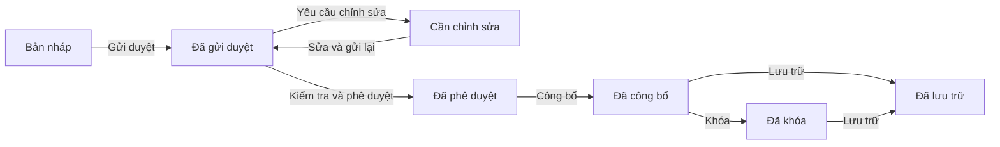

# GIAI ĐOẠN 3 - QUẢN LÝ CHƯƠNG TRÌNH VÀ KẾ HOẠCH GIÁO DỤC NĂM HỌC

## 1. Mục đích của giai đoạn

Giai đoạn 3 xây dựng toàn bộ nền tảng để nhà trường xác định trong một năm học:

- Trường đang áp dụng chương trình giáo dục nào.
- Mỗi khối học những môn nào.
- Mỗi môn có bao nhiêu tiết ở học kỳ I, học kỳ II và cả năm.
- Lớp nào thuộc tổ hợp môn tự nhiên hoặc xã hội.
- Giáo viên nào có chuyên môn để phụ trách nội dung của từng môn.
- Nội dung môn học được chia thành những giai đoạn, chương, chủ đề và bài học nào.
- Từng tuần sẽ học nội dung gì và sử dụng bao nhiêu tiết.
- Tuần nào kiểm tra, tuần nào dự phòng và kế hoạch đánh giá được tổ chức ra sao.
- Kế hoạch đã hoàn chỉnh, đã được kiểm tra, phê duyệt và công bố hay chưa.
- Học sinh, phụ huynh và giáo viên được xem phần nào sau khi công bố.

Giai đoạn này là nguồn dữ liệu đầu vào chính cho Giai đoạn 4 - Xếp thời khóa biểu tự động và Giai đoạn 5 - Lịch thi, coi thi.

## 2. Phân biệt ba khái niệm chính

### 2.1. Chương trình giáo dục

Chương trình giáo dục là khung chuẩn dùng chung cho toàn trường, ví dụ Chương trình giáo dục phổ thông 2018. Chương trình quy định môn nào áp dụng cho từng khối và số tiết chuẩn của môn đó.

Chương trình không phải là lịch dạy chi tiết. Nó là dữ liệu nền để hệ thống sinh kế hoạch cho từng năm học và từng khối.

### 2.2. Tổ hợp môn lựa chọn

Tổ hợp môn là nhóm môn lựa chọn được gán cho các lớp cụ thể trong một năm học. Các môn bắt buộc áp dụng cho mọi lớp; các môn lựa chọn chỉ áp dụng khi lớp thuộc tổ hợp có chứa môn đó.

Ví dụ:

- Các lớp 10A1 đến 10A5 thuộc tổ hợp Khoa học tự nhiên.
- Các lớp 10A6 đến 10A10 thuộc tổ hợp Khoa học xã hội.
- Một lớp chỉ được thuộc một tổ hợp trong cùng phạm vi áp dụng.

### 2.3. Kế hoạch giáo dục năm học

Kế hoạch giáo dục là bản triển khai thực tế của một chương trình cho một năm học và một khối. Kế hoạch chứa môn học, thời lượng, nội dung, phân phối theo tuần, kế hoạch kiểm tra, quy trình phê duyệt và lịch sử phiên bản.

Ví dụ: “Kế hoạch giáo dục khối 10 năm học 2027-2028 - phiên bản 2”.

## 3. Vai trò và quyền hạn

### 3.1. Quản trị viên

Quản trị viên có thể:

- Tạo, sửa và áp dụng chương trình giáo dục.
- Cấu hình môn học và số tiết cho từng khối.
- Tạo tổ hợp môn và gán tổ hợp cho lớp.
- Khai báo chuyên môn giáo viên.
- Tạo khung kế hoạch, khởi tạo dữ liệu và quản lý phiên bản.
- Chỉnh sửa mọi nội dung trong kế hoạch.
- Gửi duyệt, kiểm tra, yêu cầu chỉnh sửa, phê duyệt và công bố nếu có đủ quyền chi tiết.
- Khóa, lưu trữ hoặc tạo phiên bản điều chỉnh.
- Xuất báo cáo Excel/PDF.

### 3.2. Giáo viên

Giáo viên có quyền đọc kế hoạch và có thể cập nhật nội dung môn học khi đồng thời thỏa mãn hai điều kiện:

- Có quyền `ACADEMIC_PLAN_CONTENT_MANAGE`.
- Môn cần chỉnh sửa thuộc danh sách chuyên môn đã khai báo của giáo viên.

Giáo viên không được sửa nội dung môn ngoài chuyên môn. Giáo viên cũng không được tự thay đổi khung, phiên bản hoặc công bố kế hoạch thay quản trị viên.

### 3.3. Học sinh

Học sinh chỉ được xem kế hoạch đã công bố hoặc đã khóa của chính lớp mình. Danh sách môn hiển thị gồm:

- Các môn bắt buộc của khối.
- Các môn lựa chọn thuộc tổ hợp của lớp.
- Kế hoạch kiểm tra áp dụng cho toàn khối hoặc riêng lớp đó.

Học sinh không được xem kế hoạch bản nháp và không được xem kế hoạch của học sinh khác.

### 3.4. Phụ huynh

Phụ huynh chọn từng người con để xem kế hoạch. Hệ thống kiểm tra quan hệ phụ huynh - học sinh trước khi trả dữ liệu. Phụ huynh không thể truyền mã của học sinh không phải con mình để xem thông tin.

## 4. Hoạt động 1 - Chuẩn bị dữ liệu nền

Trước khi lập kế hoạch, hệ thống cần có:

1. Một năm học đang hoạt động.
2. Hai học kỳ thuộc năm học đó.
3. Ba khối 10, 11 và 12.
4. Danh sách lớp thuộc từng khối và năm học.
5. Danh mục môn học đang hoạt động.
6. Danh sách giáo viên và chuyên môn của giáo viên.
7. Một chương trình giáo dục đang áp dụng.

Nếu thiếu năm học, học kỳ, lớp hoặc môn, hệ thống không thể sinh đầy đủ kế hoạch và phải hiển thị lỗi để người dùng bổ sung dữ liệu nền trước.

## 5. Hoạt động 2 - Quản lý chương trình giáo dục

### 5.1. Tạo chương trình

Quản trị viên mở **Cơ cấu đào tạo → Chương trình** và thực hiện:

1. Bấm **Tạo chương trình khác**.
2. Nhập mã chương trình.
3. Nhập tên chương trình.
4. Nhập năm bắt đầu áp dụng.
5. Nhập mô tả nếu cần.
6. Bấm tạo.

Chương trình mới luôn được tạo ở trạng thái **Bản nháp**. Sau khi tạo thành công, biểu mẫu được đóng và dữ liệu nhập cũ được xóa để tránh nhầm lẫn khi thực hiện thao tác tiếp theo.

### 5.2. Áp dụng chương trình

Khi bấm **Áp dụng chương trình**:

1. Chương trình được chọn chuyển sang trạng thái **Đang áp dụng**.
2. Chương trình đang áp dụng trước đó tự chuyển sang **Đã lưu trữ**.
3. Cơ sở dữ liệu kiểm soát để không thể tồn tại hai chương trình cùng ở trạng thái đang áp dụng.

Quy tắc một chương trình đang áp dụng được bảo vệ cả ở tầng nghiệp vụ và bằng unique index trong PostgreSQL.

### 5.3. Các trạng thái chương trình

- `DRAFT`: Bản nháp, chưa dùng để lập kế hoạch chính thức.
- `ACTIVE`: Đang áp dụng, là chương trình nguồn của nhà trường.
- `ARCHIVED`: Đã lưu trữ, giữ lại để tra cứu lịch sử.

## 6. Hoạt động 3 - Cấu hình môn và số tiết theo khối

Với mỗi chương trình, quản trị viên chọn khối 10, 11 hoặc 12 và cấu hình từng môn:

- Môn học.
- Loại môn.
- Có bắt buộc hay không.
- Số tiết học kỳ I.
- Số tiết học kỳ II.
- Số tiết mỗi tuần dự kiến.
- Tổng số tiết cả năm.
- Ghi chú.

Các loại môn hỗ trợ gồm môn bắt buộc, môn lựa chọn, chuyên đề và hoạt động giáo dục theo cấu hình của hệ thống.

### Quy tắc tính thời lượng

Tổng số tiết cả năm được tính theo công thức:

`Tổng tiết cả năm = Tiết học kỳ I + Tiết học kỳ II`

Người dùng không nhập độc lập cột cả năm trên giao diện. Khi tăng môn Sinh học học kỳ I từ 35 lên 36 tiết và học kỳ II giữ 35 tiết, cột cả năm tự đổi từ 70 thành 71 tiết.

Điều này tránh tình trạng học kỳ I và học kỳ II đã thay đổi nhưng tổng cả năm vẫn giữ số cũ.

## 7. Hoạt động 4 - Quản lý tổ hợp môn lựa chọn

### 7.1. Tạo tổ hợp

Quản trị viên mở **Tổ hợp môn**, hệ thống luôn hiển thị rõ năm học đang áp dụng. Sau đó:

1. Chọn khối.
2. Bấm **Tạo tổ hợp**.
3. Nhập mã tổ hợp.
4. Nhập tên tổ hợp.
5. Chọn danh sách môn thuộc tổ hợp.
6. Nhập số lớp dự kiến và số học sinh tối đa.
7. Lưu tổ hợp.

Hệ thống kiểm tra:

- Mã và tên không được trống.
- Tổ hợp phải có ít nhất một môn.
- Không được chọn trùng một môn trong cùng tổ hợp.
- Môn phải tồn tại trong danh mục.
- Năm học và khối phải hợp lệ.

### 7.2. Gán tổ hợp cho lớp

Mỗi tổ hợp có khu vực chọn lớp riêng. Khi người dùng tích một lớp ở tổ hợp mới:

1. Lớp được chọn trong tổ hợp mới.
2. Dấu chọn của lớp trong tổ hợp cũ được bỏ ngay trên giao diện.
3. Khi lưu, danh sách mới thay thế chính xác danh sách gán trước đó.
4. Hệ thống hiển thị lại tên các lớp đã gán ngay dưới tổ hợp.

Người dùng có thể bỏ toàn bộ lớp khỏi một tổ hợp bằng cách bỏ tất cả dấu chọn và lưu danh sách rỗng.

### 7.3. Cách tổ hợp ảnh hưởng đến học sinh

Khi học sinh hoặc phụ huynh xem kế hoạch:

- Môn bắt buộc luôn được hiển thị.
- Môn lựa chọn chỉ được hiển thị nếu tổ hợp của lớp chứa môn đó.
- Các môn chỉ thuộc tổ hợp khác bị ẩn.

## 8. Hoạt động 5 - Khai báo chuyên môn giáo viên

Nhà trường có thể khai báo một hoặc nhiều môn mà giáo viên có thể giảng dạy và xác định một môn chính.

Khi giáo viên chỉnh sửa giai đoạn, chương, chủ đề, bài học, phân phối tuần hoặc kế hoạch kiểm tra, backend kiểm tra chuyên môn chứ không chỉ ẩn nút trên giao diện. Nếu giáo viên cố gọi API của môn khác, hệ thống trả về `403 Forbidden`.

## 9. Hoạt động 6 - Tạo kế hoạch giáo dục

Quản trị viên mở **Kế hoạch đào tạo** và thực hiện:

1. Chọn năm học.
2. Chọn khối.
3. Chọn chương trình giáo dục nguồn.
4. Nhập tên kế hoạch.
5. Nhập mô tả nếu cần.
6. Cấu hình ngưỡng chênh tiến độ tối đa.
7. Bấm **Tạo kế hoạch**.

Kế hoạch mới có trạng thái `DRAFT` và phiên bản số 1. Một kế hoạch thuộc về đúng một năm học, một khối và một chương trình nguồn.

## 10. Hoạt động 7 - Khởi tạo kế hoạch từ chương trình

Tại bước **Tổng quan & môn học**, người dùng bấm **Khởi tạo từ chương trình**.

Hệ thống tự động:

1. Đọc các môn đã cấu hình cho khối trong chương trình nguồn.
2. Tạo dòng học kỳ I và học kỳ II cho từng môn.
3. Gán ngày bắt đầu và kết thúc theo học kỳ.
4. Tạo khung giai đoạn ban đầu.
5. Tạo nội dung chương trình mẫu theo môn.
6. Tạo phân phối theo tuần ban đầu.
7. Tạo tuần kiểm tra và tuần dự phòng.
8. Tạo kế hoạch kiểm tra cơ bản cho các môn cần thi.

Thao tác này có tính chống trùng. Bấm khởi tạo lần thứ hai không được tạo thêm dòng môn, nội dung, phân phối hoặc kế hoạch kiểm tra đã tồn tại.

## 11. Hoạt động 8 - Hoàn thiện kế hoạch theo năm bước

Giao diện kế hoạch được chia thành năm nút thay vì một trang cuộn dài. Người dùng hoàn thành lần lượt từng bước.

### Bước 1 - Tổng quan và môn học

Người dùng kiểm tra:

- Tên và mô tả kế hoạch.
- Năm học, khối và chương trình áp dụng.
- Phiên bản và trạng thái hiện tại.
- Danh sách môn của học kỳ I và học kỳ II.
- Số tiết mỗi tuần.
- Tổng số tiết từng học kỳ.
- Ngày bắt đầu và kết thúc môn.
- Môn có yêu cầu kiểm tra hay không.
- Tổng học kỳ I + học kỳ II có khớp số tiết cả năm trong chương trình hay không.

Kết quả tổng hợp hiển thị số tiết HK1, HK2, cả năm, số tiết chuẩn và trạng thái **Đã khớp/Chưa khớp**.

### Bước 2 - Nội dung môn học

Người dùng chọn một môn và học kỳ để quản lý ba nhóm nội dung.

#### Giai đoạn

Mỗi giai đoạn có:

- Mã và tên.
- Thứ tự.
- Ngày bắt đầu, ngày kết thúc.
- Chỉ tiêu số tiết.
- Mô tả.

Hệ thống không cho giai đoạn nằm ngoài thời gian của môn và không cho tổng chỉ tiêu giai đoạn vượt tổng số tiết môn.

#### Chương trình môn học

Nội dung được tổ chức theo cây:

- Chương.
- Chủ đề.
- Bài học.

Mỗi nội dung có mã, tên, thứ tự, số tiết dự kiến, mô tả và quan hệ cha - con. Tổng số tiết bài học được đối chiếu với tổng số tiết môn.

#### Tuần đặc biệt

Người dùng khai báo:

- Tuần kiểm tra.
- Tuần dự phòng.
- Tên và ghi chú của tuần.

Số tuần phải nằm trong phạm vi học kỳ.

### Bước 3 - Phân phối chương trình theo tuần

Người dùng phân bổ từng môn theo tuần với các thông tin:

- Tuần học.
- Bài học hoặc nội dung liên quan.
- Loại nội dung.
- Tiêu đề.
- Số tiết.
- Ghi chú.

Các loại nội dung gồm:

- Lý thuyết.
- Thực hành.
- Ôn tập.
- Kiểm tra.
- Dự án.
- Trải nghiệm.
- Dự phòng.

Hệ thống tổng hợp số tiết đã phân phối và so sánh với tổng số tiết môn. Phân phối không được tham chiếu sang bài học của môn khác hoặc kế hoạch khác.

### Bước 4 - Kế hoạch kiểm tra đánh giá

Người dùng khai báo:

- Học kỳ.
- Môn học.
- Áp dụng toàn khối hoặc cho một lớp.
- Loại kiểm tra.
- Tuần dự kiến.
- Thời lượng từ 15 đến 300 phút.
- Giáo viên phụ trách.
- Ghi chú.

Hệ thống kiểm tra tuần thuộc học kỳ, môn thuộc kế hoạch, lớp thuộc đúng năm học và khối, giáo viên có chuyên môn phù hợp.

Kế hoạch kiểm tra ở bước này là dữ liệu dự kiến. Giai đoạn 5 sử dụng dữ liệu đó để lập đợt thi, phòng thi và phân công giám thị chi tiết.

### Bước 5 - Duyệt và công bố

Hệ thống chạy kiểm tra toàn bộ kế hoạch và chia kết quả thành:

- **Lỗi:** bắt buộc phải sửa, không được gửi duyệt.
- **Cảnh báo:** nên kiểm tra nhưng không chặn gửi duyệt.
- **Thông tin:** dữ liệu bổ sung để người dùng tham khảo.

Một số lỗi bắt buộc:

- Thiếu môn bắt buộc.
- Thiếu dòng HK1 hoặc HK2.
- Tổng tiết hai học kỳ không khớp cả năm.
- Thiếu giai đoạn hoặc tổng tiết giai đoạn không khớp.
- Thiếu bài học hoặc tổng tiết bài học không khớp.
- Thiếu tuần kiểm tra hoặc tuần dự phòng.
- Thiếu kế hoạch kiểm tra đối với môn bắt buộc phải thi.

## 12. Hoạt động 9 - Quy trình phê duyệt

Quy trình trạng thái được thực hiện như sau:

1. `DRAFT`: Người lập đang chỉnh sửa.
2. `SUBMITTED`: Đã gửi để kiểm tra.
3. Người có quyền review chọn một trong hai hướng:
   - Xác nhận đã kiểm tra.
   - Yêu cầu chỉnh sửa, chuyển sang `REVISION_REQUIRED`.
4. Sau khi được kiểm tra, người có quyền approve chuyển kế hoạch sang `APPROVED`.
5. Kế hoạch đã phê duyệt được công bố thành `PUBLISHED`.
6. Kế hoạch có thể được khóa thành `LOCKED` hoặc lưu trữ thành `ARCHIVED` khi phù hợp.

Mỗi thao tác bắt buộc có nhận xét hoặc lý do. Hệ thống lưu người thực hiện, trạng thái trước, trạng thái sau và thời gian xử lý.

## 13. Hoạt động 10 - Quản lý phiên bản

Kế hoạch đã công bố không được sửa trực tiếp. Khi cần thay đổi:

1. Người dùng chọn kế hoạch đã công bố.
2. Bấm **Tạo phiên bản điều chỉnh**.
3. Hệ thống tạo phiên bản mới ở trạng thái bản nháp.
4. Toàn bộ môn, giai đoạn, chương/chủ đề/bài học, tuần đặc biệt, phân phối tuần và kế hoạch kiểm tra được sao chép sang phiên bản mới.
5. Người dùng chỉ sửa phần cần điều chỉnh.
6. Phiên bản mới phải đi lại quy trình kiểm tra, phê duyệt và công bố.
7. Phiên bản cũ vẫn được giữ để đối chiếu.

Khi công bố phiên bản mới, phiên bản công bố cũ cùng phạm vi được lưu trữ. Việc chuyển qua lại giữa các phiên bản không được dùng dữ liệu chi tiết còn sót lại của phiên bản trước.

## 14. Hoạt động 11 - Công bố cho người dùng cuối

### Giáo viên

Giáo viên mở lớp được phân công và xem:

- Tên kế hoạch đã công bố.
- Phiên bản.
- Môn giáo viên phụ trách.
- Số tiết HK1, HK2 và cả năm.
- Nội dung và kế hoạch kiểm tra của môn khi có quyền đọc.

### Học sinh

Học sinh mở **Theo dõi học thuật → Kế hoạch giáo dục** và xem:

- Kế hoạch của đúng năm học và khối hiện tại.
- Lớp hiện tại.
- Trạng thái và ngày công bố.
- Môn bắt buộc.
- Môn thuộc tổ hợp của lớp.
- Kế hoạch kiểm tra áp dụng cho lớp.

### Phụ huynh

Phụ huynh chọn một người con rồi xem cùng dữ liệu mà học sinh đó được phép xem. Nếu phụ huynh có nhiều con, mỗi lần chỉ xem dữ liệu của người con đang được chọn.

## 15. Hoạt động 12 - Báo cáo và xuất tệp

Người có quyền đọc kế hoạch có thể xuất:

- Excel: tổng hợp môn và số tiết, phân phối theo tuần, phân công giáo viên và dữ liệu kế hoạch liên quan.
- PDF: bản kế hoạch định dạng đọc/in với thông tin kế hoạch và tổng hợp môn học.

Tệp được tạo từ dữ liệu của đúng `planId` đang chọn. Mỗi lần xuất đều ghi audit với người xuất, thời gian, loại tệp và kế hoạch được xuất.

## 16. Audit và an toàn dữ liệu

Hệ thống ghi audit cho các thao tác quan trọng:

- Tạo, sửa và áp dụng chương trình.
- Tạo, sửa và gán tổ hợp.
- Khai báo chuyên môn giáo viên.
- Tạo, sửa, xóa kế hoạch bản nháp.
- Khởi tạo kế hoạch từ chương trình.
- Thêm, sửa, xóa môn, giai đoạn, nội dung, tuần đặc biệt và phân phối tuần.
- Thêm, sửa, xóa kế hoạch kiểm tra.
- Gửi duyệt, review, yêu cầu chỉnh sửa, phê duyệt, công bố và lưu trữ.
- Tạo phiên bản mới.
- Xuất Excel/PDF.

Các thao tác sửa nội dung chỉ hợp lệ khi kế hoạch ở `DRAFT` hoặc `REVISION_REQUIRED`. Kế hoạch đã công bố hoặc đã khóa là dữ liệu chỉ đọc.

## 17. Luồng sử dụng đầy đủ từ đầu đến cuối

Một quy trình thực tế được thực hiện theo thứ tự:

1. Admin mở năm học và xác nhận hai học kỳ.
2. Admin kiểm tra khối, lớp và danh mục môn.
3. Admin chọn hoặc tạo chương trình giáo dục.
4. Admin cấu hình số tiết HK1, HK2 và cả năm theo từng khối.
5. Admin áp dụng một chương trình duy nhất.
6. Admin tạo tổ hợp KHTN/KHXH và chọn môn.
7. Admin gán mỗi lớp vào đúng một tổ hợp.
8. Admin khai báo chuyên môn giáo viên.
9. Admin tạo kế hoạch giáo dục cho từng khối.
10. Admin khởi tạo dữ liệu từ chương trình.
11. Giáo viên hoặc Admin hoàn thiện nội dung môn học.
12. Giáo viên hoặc Admin phân phối nội dung theo tuần.
13. Giáo viên hoặc Admin nhập kế hoạch kiểm tra.
14. Hệ thống kiểm tra lỗi và cảnh báo.
15. Người lập gửi duyệt.
16. Người kiểm tra xác nhận hoặc yêu cầu chỉnh sửa.
17. Người phê duyệt phê duyệt kế hoạch.
18. Admin công bố kế hoạch.
19. Giáo viên, học sinh và phụ huynh xem dữ liệu theo quyền.
20. Khi có thay đổi, Admin tạo phiên bản điều chỉnh thay vì sửa bản công bố.

## 18. Kịch bản kiểm thử FE đề xuất

### Tài khoản

- Admin: `admin / admin@123`.
- Giáo viên Toán: `gv.toan / teacher@123`.
- Học sinh 10A1: `hs.thao / student@123`.
- Phụ huynh: `ph.vu / parent@123`.

### Kiểm thử chương trình

1. Đăng nhập Admin.
2. Mở **Cơ cấu đào tạo → Chương trình**.
3. Kiểm tra chỉ một chương trình có trạng thái đang áp dụng.
4. Sửa tiết HK1 của Sinh học và kiểm tra cả năm tự tăng.
5. Tạo chương trình mới và kiểm tra trạng thái bản nháp.
6. Áp dụng chương trình mới và kiểm tra chương trình cũ đã lưu trữ.

### Kiểm thử tổ hợp

1. Mở **Tổ hợp môn**.
2. Kiểm tra năm học đang áp dụng được hiển thị.
3. Chọn khối 10.
4. Chuyển 10A1 từ KHTN sang KHXH.
5. Kiểm tra 10A1 tự bỏ khỏi KHTN.
6. Chuyển lại 10A1 về KHTN, lưu và tải lại trang.
7. Kiểm tra lớp chỉ nằm trong một tổ hợp.

### Kiểm thử kế hoạch

1. Mở **Kế hoạch đào tạo**.
2. Chọn năm học, khối và phiên bản.
3. Kiểm tra đủ năm bước trên giao diện.
4. Khởi tạo từ chương trình hai lần và xác nhận không sinh trùng.
5. Kiểm tra tổng HK1 + HK2 bằng cả năm.
6. Thêm hoặc sửa nội dung ở bước 2-4.
7. Mở bước 5, xử lý hết lỗi bắt buộc.
8. Gửi duyệt, xác nhận kiểm tra, phê duyệt và công bố.
9. Kiểm tra bản công bố không còn nút sửa trực tiếp.
10. Tạo phiên bản điều chỉnh và kiểm tra dữ liệu được sao chép đầy đủ.
11. Xuất Excel/PDF và mở tệp.

### Kiểm thử theo vai trò

1. Đăng nhập giáo viên Toán và thử sửa môn Toán: được phép.
2. Giáo viên Toán thử sửa môn khác: backend trả `403`.
3. Đăng nhập học sinh 10A1: chỉ thấy môn bắt buộc và KHTN.
4. Đăng nhập phụ huynh: chọn đúng con và xem kế hoạch.
5. Thử gọi dữ liệu của học sinh không phải con: backend trả `403`.

## 19. Kết quả nghiệm thu hiện tại

### Phạm vi đã nghiệm thu

- Chương trình giáo dục không còn hardcode số môn hoặc số tiết trong thuật toán.
- Chỉ một chương trình được phép ở trạng thái đang áp dụng.
- Tổng tiết cả năm tự động đồng bộ với hai học kỳ.
- Tổ hợp được quản lý theo năm học, khối và lớp.
- Một lớp không thể đồng thời thuộc hai tổ hợp.
- Kế hoạch được chia thành năm bước rõ ràng.
- Khởi tạo dữ liệu có chống trùng.
- Giáo viên bị giới hạn theo chuyên môn ở backend.
- Có kiểm tra lỗi/cảnh báo trước gửi duyệt.
- Có quy trình gửi duyệt, review, yêu cầu chỉnh sửa, phê duyệt và công bố.
- Có lịch sử phiên bản và không sửa trực tiếp bản đã công bố.
- Giáo viên, học sinh và phụ huynh xem dữ liệu thật theo quyền.
- Có xuất Excel/PDF và audit thao tác xuất.

### Phạm vi chưa nghiệm thu về UX

Giai đoạn 3 mới được xem là hoàn thành phần nghiệp vụ, dữ liệu và màn quản trị. Giao diện dành cho Giáo viên, Học sinh và Phụ huynh vẫn cần được thiết kế lại sau khi hoàn thiện Giai đoạn 4 và 5.

- Giáo viên hiện chưa có góc nhìn công việc đủ rõ để hiểu ngay lớp nào, môn nào, học kỳ nào, nội dung nào cần thực hiện và tiến độ đang ở đâu.
- Học sinh cần màn xem kế hoạch đã công bố theo lớp, học kỳ và môn, ưu tiên nội dung sắp học và lịch kiểm tra thay vì hiển thị cấu trúc quản trị.
- Phụ huynh cần chọn từng con, xem kế hoạch đã công bố theo học kỳ, lịch kiểm tra và các thay đổi quan trọng bằng ngôn ngữ đơn giản.
- Ba role chỉ được xem dữ liệu đã công bố và đúng phạm vi quyền; không hiển thị thuật ngữ, nút hoặc trạng thái nội bộ dành cho Admin.
- Mọi màn phải có trạng thái tải, rỗng, lỗi, dữ liệu chưa công bố và liên kết điều hướng rõ ràng.

Vì vậy trạng thái chính xác của Giai đoạn 3 là: **nghiệp vụ lõi đã hoàn thành; UX ba role còn chờ nâng cấp và nghiệm thu lại**.

## 20. Quan hệ với các giai đoạn tiếp theo

### Giai đoạn 4 - Xếp thời khóa biểu tự động

Giai đoạn 4 phải sử dụng:

- Chương trình đang áp dụng.
- Tổ hợp môn của từng lớp.
- Số tiết mỗi tuần trong kế hoạch.
- Ngày bắt đầu/kết thúc môn.
- Phân công và chuyên môn giáo viên.
- Phân phối chương trình và ngưỡng chênh tiến độ.

### Giai đoạn 5 - Lịch thi và coi thi

Giai đoạn 5 phải sử dụng:

- Môn có yêu cầu thi.
- Học kỳ.
- Kế hoạch kiểm tra đã được lập ở bước 4.
- Khối/lớp áp dụng.
- Tuần dự kiến và thời lượng từng môn.

### Giai đoạn 6 - Hoàn thiện khoảng trống

Sau khi nghiệm thu Giai đoạn 4 và 5, phải hoàn thành đợt nâng cấp giao diện Giáo viên, Học sinh và Phụ huynh cho dữ liệu của cả Giai đoạn 3-5. Chỉ sau khi ba role được nghiệm thu mới tiếp tục lần lượt:

1. Cấu hình điểm theo môn/học kỳ.
2. Đơn xin nghỉ và duyệt nghỉ.
3. Bài tập nâng cao.
4. Ngoại khóa có phí.
5. Chat phụ huynh - giáo viên chủ nhiệm.
6. SendGrid, FCM, retry và delivery log.
7. Báo cáo học vụ đầy đủ.
8. OpenAPI, Postman, audit Mongo và kiểm thử tải.

## 21. Kết luận

Giai đoạn 3 tạo ra một quy trình liên tục từ cấu hình chương trình đến công bố kế hoạch:

**Năm học → Chương trình → Môn và số tiết → Tổ hợp lớp → Chuyên môn giáo viên → Kế hoạch theo khối → Nội dung môn → Phân phối tuần → Kiểm tra đánh giá → Duyệt → Công bố → Người dùng cuối xem.**

Kết quả không chỉ phục vụ hiển thị kế hoạch mà còn trở thành nguồn dữ liệu chuẩn cho thời khóa biểu, lịch thi, theo dõi tiến độ, báo cáo và ứng dụng mobile sau này.
